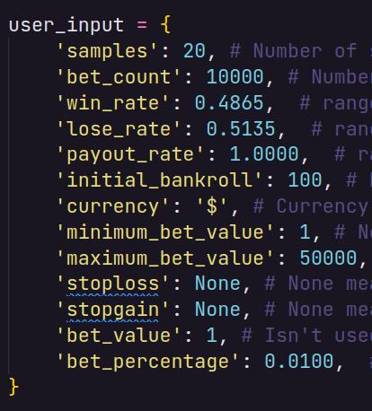
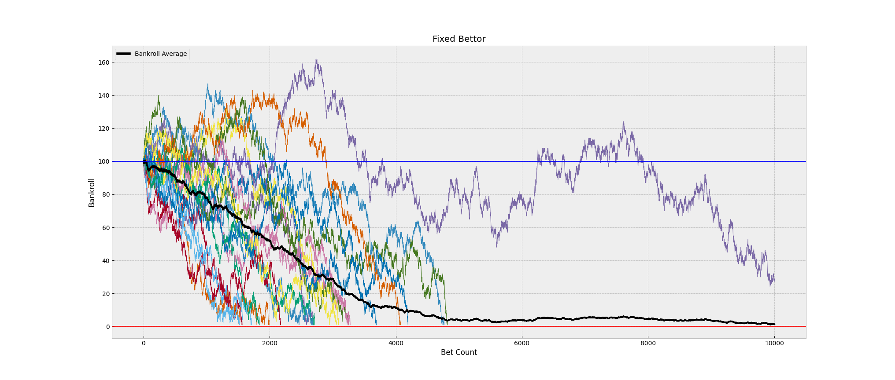
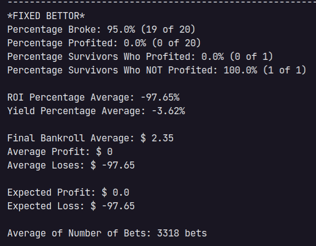
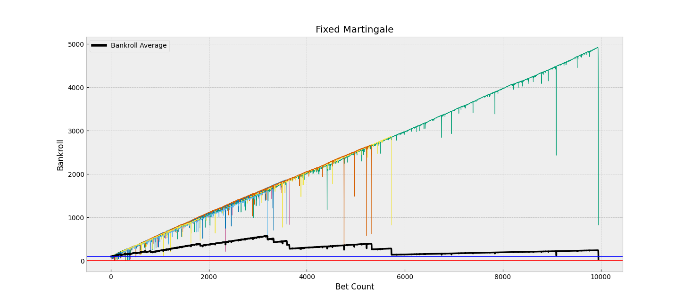
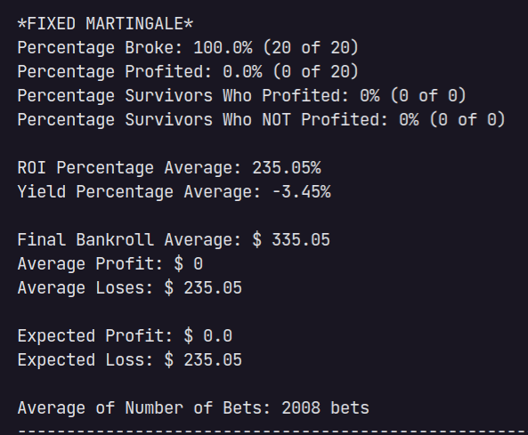
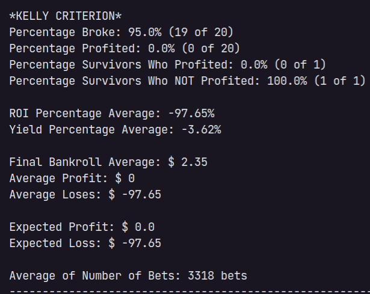
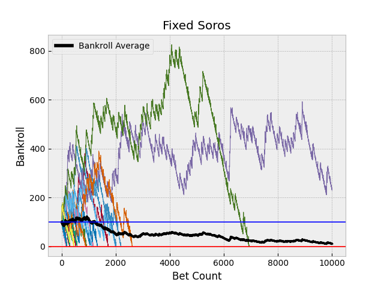
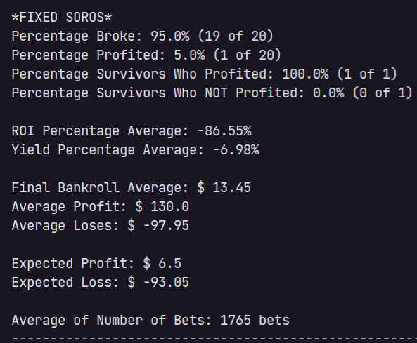
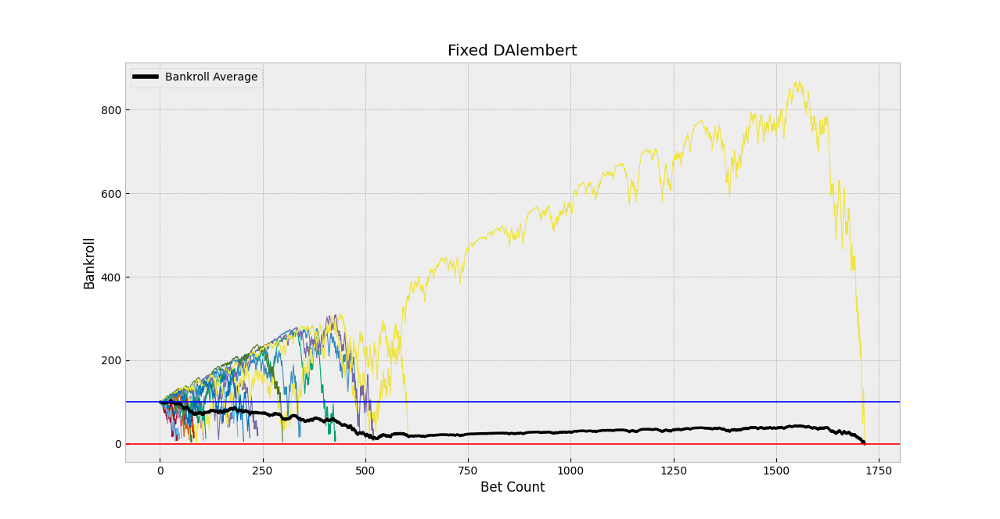
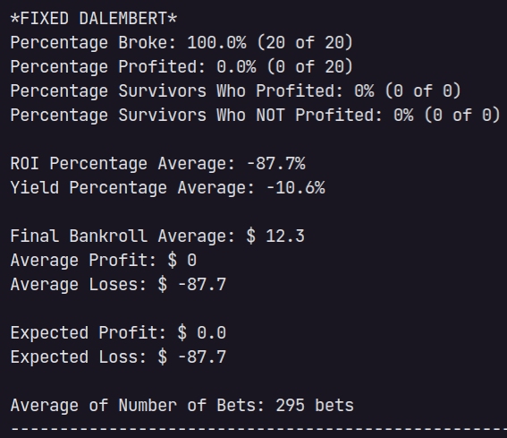

<br />
<p align="center">
  <h3 align="center">Monte Carlo Betting Simulations </h3>

  <p align="center">
    A collection of Monte Carlo simulations for betting strategies like the Martingale, D'Alembert, and much more, see [here](#features) for a full list. The project generates a series of plots for each strategy, and also generates a summary table of the results.
    <br />
    <br />
    <a href="https://github.com/xandao-dev/monte-carlo-betting-simulations"><strong>Explore the docs »</strong></a>
    <br />
    <a href="https://github.com/xandao-dev/monte-carlo-betting-simulations/issue">Report Bug</a>
    ·
    <a href="https://github.com/xandao-dev/monte-carlo-betting-simulations/issues">Request Feature</a>
  </p>
</p>

<!-- TABLE OF CONTENTS -->
<details open="open">
  <summary>Table of Contents</summary>
  <ol>
    <li>
      <a href="#about-the-project">About The Project</a>
      <ul>
        <li><a href="#features">Features</a></li>
        <li><a href="#built-with">Built With</a></li>
      </ul>
    </li>
    <li><a href="#usage">Usage</a></li>
    <li><a href="#roadmap">Roadmap</a></li>
    <li><a href="#contributing">Contributing</a></li>
    <li><a href="#license">License</a></li>
    <li><a href="#contact">Contact</a></li>
  </ol>
</details>


<!-- ABOUT THE PROJECT -->
## About The Project

  Sample with the Fixed Bettor, Fixed Martingale, Fixed D'Alembert, Fixed Soros and Kelly Criterion in <b>European Roulette</b>, betting on red/black (same as odd/even or high/low).
  <br>
  It was run 20 simulations of 10000 bets each, for each strategy and the initial bankroll was 100$.
<div align="center">
  <a href="https://github.com/xandao-dev/monte-carlo-betting-simulations">
    
    
    
    
    
    
    
    
    
    
    
  </a>
</div>

### Features

* Template Method Design Pattern, so it's easy to add new strategies.
* Plots and summary table for each strategy.
* **List of strategies**:

  * **Fixed Bettor** - Bet the same amount of money every time.
  * **Percentage Bettor** - Bet a fixed percentage of the bankroll every time.
  * **[Kelly Criterion](https://en.wikipedia.org/wiki/Kelly_criterion)** - Bet a percentage of the bankroll based on the probability of winning.
  * **[Fixed Martingale](https://pt.wikipedia.org/wiki/Martingale)** - Double the bet every time you lose.
  * **[Fixed Martingale Inverted](https://en.wikipedia.org/wiki/Martingale_(betting_system)#Anti-martingale)** - Also known as Anti-Martingale, double the bet every time you win.
  * **Percentage Martingale** - Same as Fixed Martingale, but the bet is a percentage of the bankroll.
  * **Percentage Martingale** with Kelly Percentage - Same as Percentage Martingale, but the percentage is calculated using the Kelly Criterion.
  * **Percentage Martingale Inverted** - Same as Fixed Martingale Inverted, but the bet is a percentage of the bankroll.
  * **Percentage Martingale Inverted with Kelly Percentage** - Same as Percentage Martingale Inverted, but the percentage is calculated using the Kelly Criterion.
  * **Fixed Soros** - A strategy where you reinvests the winnings of the previous bet.
  * **Percentage Soros** - Same as Fixed Soros, but the bet is a percentage of the bankroll.
  * **Percentage Soros with Kelly Percentage** - Same as Percentage Soros, but the percentage is calculated using the Kelly Criterion.
  * **Fixed Fibonacci** - A strategy where you bet the next number in the Fibonacci sequence, when you lose.
  * **Fixed Fibonacci Inverted** - Also known as Anti-Fibonacci, it's a strategy where you bet the net number in the Fibonacci sequence, when you win.
  * **Percentage Fibonacci** - Same as Fixed Fibonacci, but the bet is a percentage of the bankroll.
  * **Percentage Fibonacci with Kelly Percentage** - Same as Percentage Fibonacci, but the percentage is calculated using the Kelly Criterion.
  * **Percentage Fibonacci Inverted** - Same as Fixed Fibonacci Inverted, but the bet is a percentage of the bankroll.
  * **Percentage Fibonacci Inverted with Kelly Percentage** - Same as Percentage Fibonacci Inverted, but the percentage is calculated using the Kelly Criterion.
  * **[Fixed DAlembert](https://en.wikipedia.org/wiki/D%27Alembert_system)** - Increase or decrease the bet by 1 unit every time you win or lose, respectively.
  * **Fixed DAlembert Inverted** - Also known as Anti-D'Alembert, increase or decrease the bet by 1 unit every time you lose or win, respectively.


### Built With

* [Python3](https://www.python.org/) - A general-purpose, high-level programming language
* [random](https://docs.python.org/3/library/random.html) - A library for generating random numbers
* [matplotlib](https://matplotlib.org/) - A comprehensive library for creating static, animated, and interactive visualizations
* [scipy](https://www.scipy.org/) - A Python-based ecosystem of open-source software for mathematics, science, and engineering

<!-- USAGE EXAMPLES -->
## Usage

1. Install the dependencies

    ```sh
    pip install -r requirements.txt
    ```
2. Configure the input data in the [main.py](./main.py) file.

3. Comment or uncomment the strategies you want to run in the [main.py](./main.py) file.

3. Run the simulator

    ```sh
    python3 main.py
    ```


<!-- ROADMAP -->
## Roadmap

See the [open issues](https://github.com/xandao-dev/monte-carlo-betting-simulations/issues) for a list of proposed features (and known issues).


<!-- CONTRIBUTING -->
## Contributing

Contributions are what make the open source community such an amazing place to be learn, inspire, and create. Any contributions you make are **greatly appreciated**.

1. Fork the Project
2. Create your Feature Branch (`git checkout -b feature/AmazingFeature`)
3. Commit your Changes (`git commit -m 'Add some AmazingFeature'`)
4. Push to the Branch (`git push origin feature/AmazingFeature`)
5. Open a Pull Request

<!-- LICENSE -->
## License

Distributed under the MIT License. See [LICENSE](./LICENSE.md) for more information.

Free software =)


<!-- CONTACT -->
## Contact

Alexandre Calil - [Linkedin](https://www.linkedin.com/in/xandao-dev/) - [alexandre@xandao.dev](mailto:alexandre@xandao.dev)

Project Link: [https://github.com/xandao-dev/monte-carlo-betting-simulations](https://github.com/xandao-dev/monte-carlo-betting-simulations)
